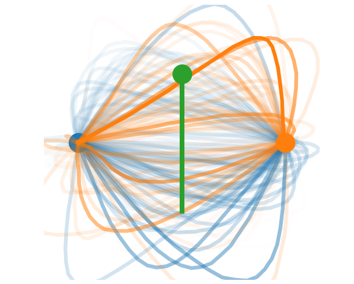
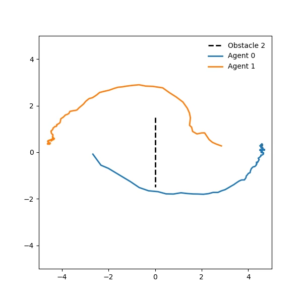

## Game-Theoretic Static Obstacle Avoidance

This is an independent research project I did during my time as a student, which attempts to extend one of my favorite
works ([Mixed Strategy Nash Equilibrium for Crowd Navigation](https://arxiv.org/abs/2403.01537)) to avoid static
obstacles without a meta-planner in an efficient, optimal, and stable manner.

This is achieved by modeling obstacles as their own separate agents at the same exact position where the agent currently
being iterated upon is located projected to a tangent line representing the actual geometry of the obstacle in the 2D
space. Below are some visual results of this research.

<table align="center">
  <tr>
    <td align="center">
      
    </td>
    <td align="center">
      
    </td>
  </tr>
  <tr>
    <td align="center">Figure 1: Stochastic Modeling</td>
    <td align="center">Figure 2: Final result</td>
  </tr>
</table>
